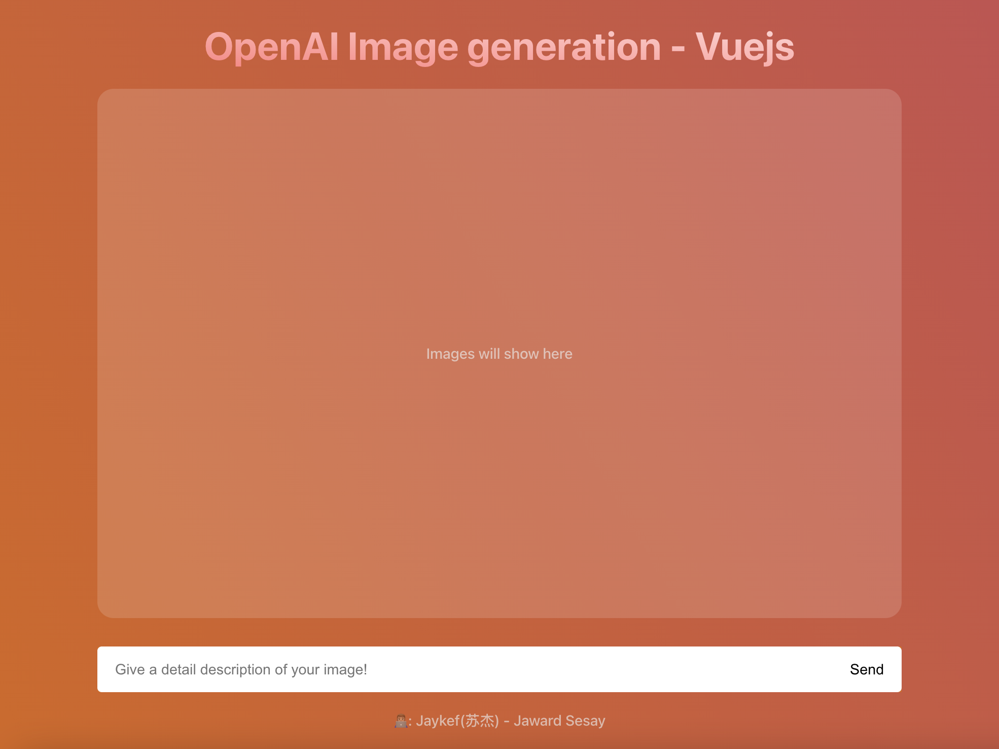
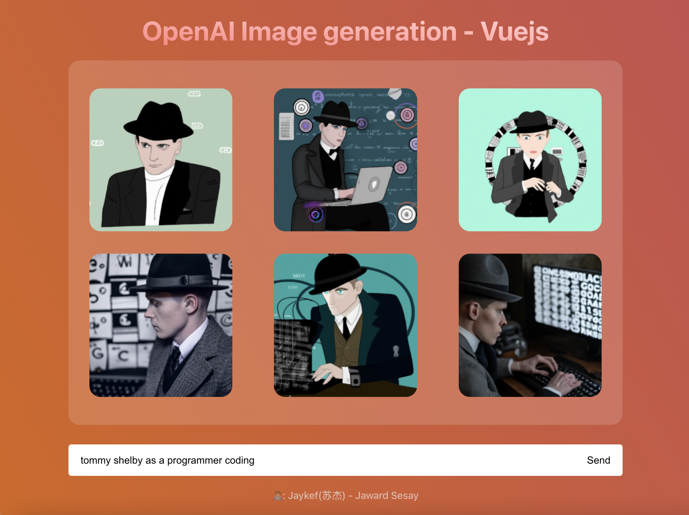
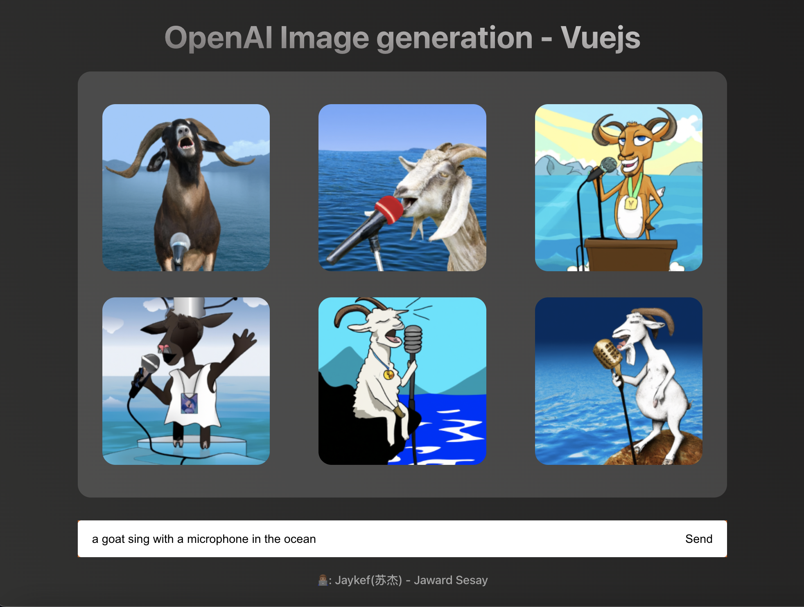
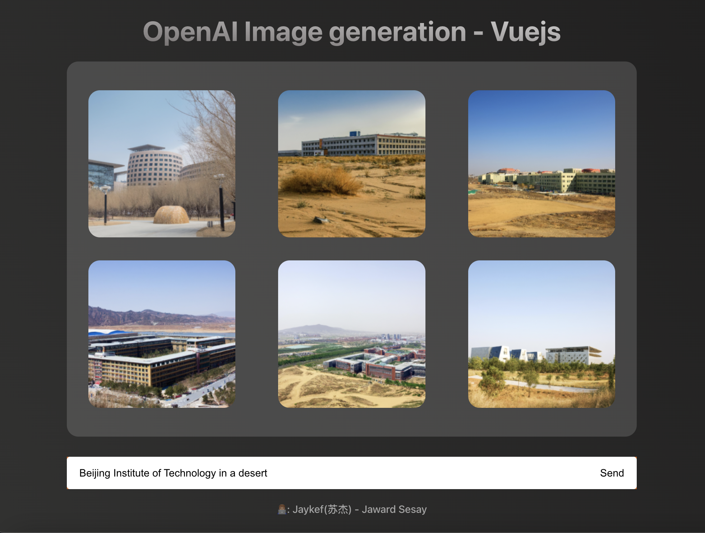

# OpenAI-ImageGeneration-Vue3
Utilizing OpenAI's Image Generation api with vue3, vite and pinia(similar to the DALLE app)

## Project Setup
Create a .env file and add in you OpenAI API key:

```sh
VITE_OpenApiKey=YOUR_API_KEY
```
## Customize configuration
See [Vite Configuration Reference](https://vitejs.dev/config/).
```sh
npm install
```

### Compile and Hot-Reload for Development

```sh
npm run dev
```

### Compile and Minify for Production

```sh
npm run build
```





